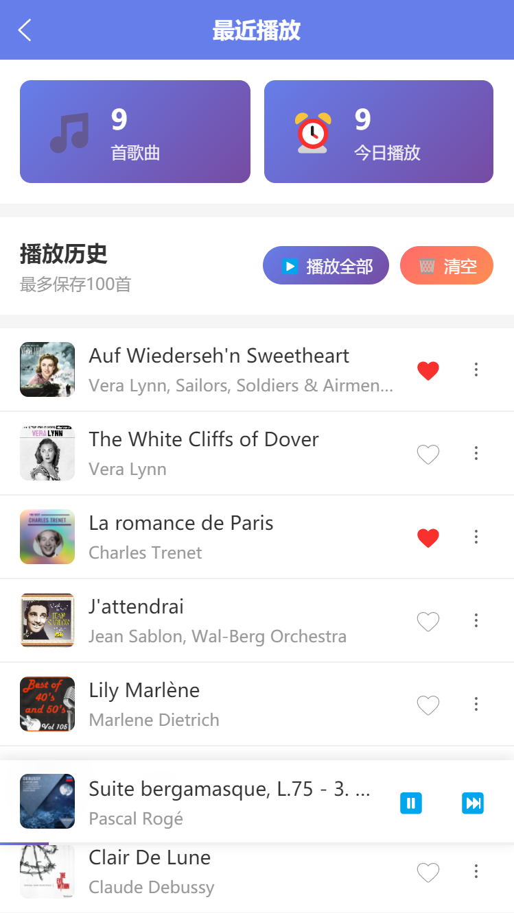

# 🎵 iMusic - 在线音乐播放器

一个基于 **Uniapp + Vue 3** 开发的全功能在线音乐播放器，支持多端运行（H5/小程序/App），提供完整的音乐搜索、播放、收藏、歌单等功能。

## ✨ 项目简介

iMusic 是一个现代化的在线音乐播放器应用，采用 Uniapp 跨平台框架开发，集成网易云音乐 API，配备完整的用户系统和后端服务，支持歌曲搜索、在线播放、歌词显示、收藏管理、播放历史等丰富功能。

## 🚀 核心功能

### 🎧 音乐功能
- **🔍 智能搜索**: 支持歌曲名、歌手名搜索，实时返回结果
- **🎵 在线播放**: 高质量音乐流畅播放，支持播放列表管理
- **📝 歌词同步**: LRC 格式歌词实时滚动显示，高亮当前播放行
- **⏯️ 播放控制**: 播放/暂停、上一首/下一首、进度条拖动、循环模式切换
- **🎨 迷你播放器**: 全局悬浮播放器，随时控制音乐播放

### 📱 发现页面
- **🎼 排行榜**: 接入网易云音乐实时排行榜（云音乐新歌榜、飙升榜等）
- **📋 歌单详情**: 查看歌单内容，支持播放歌单中的歌曲
- **🎯 分类推荐**: 个性化音乐分类推荐（已实现 UI，待接入真实数据）
- **🎪 歌单列表**: 浏览和管理我的歌单
- **📻 在线电台**: 收听一些在线电台

### 👤 用户系统
- **🔐 登录注册**: 完整的用户认证系统，支持游客模式
- **👤 个人中心**: 用户信息管理、头像上传、密码修改
- **⭐ 收藏功能**: 收藏喜欢的歌曲，支持本地存储和服务器同步
- **📜 播放历史**: 自动记录播放历史，支持查看和清空
- **⬇️ 下载功能**: 歌曲下载管理
- **⚙️ 设置中心**: 个性化设置（主题、播放模式等）

### 🎯 技术亮点
- **📦 按需加载**: 歌单数据按需加载，优化性能
- **💾 智能缓存**: 多级缓存策略（搜索缓存、歌单缓存、歌曲详情缓存）
- **🔄 数据同步**: 登录后自动同步本地收藏和历史到服务器
- **🌐 跨域处理**: 完善的 API 代理配置，解决 H5 跨域问题
- **📱 多端适配**: 支持 H5、微信小程序、App 多端运行

## 🛠️ 技术栈

### 前端技术
- **框架**: Uniapp + Vue 3 + Vite 5
- **状态管理**: Vuex 3.x（模块化设计）
- **UI**: 原生组件 + 自定义组件
- **开发工具**: HBuilderX / VSCode

### 后端技术
- **运行环境**: Node.js
- **框架**: Express
- **数据库**: Microsoft SQL Server
- **文件上传**: Multer
- **跨域处理**: CORS

### 第三方服务
- **音乐 API**: 网易云音乐 API
  - 搜索接口: `/api/search/get/web`
  - 歌曲详情: `/api/song/detail`
  - 歌词接口: `/api/song/lyric`
  - 歌单详情: `/api/playlist/detail`
  - 排行榜: `/api/toplist/detail`

## 📂 项目结构

```
iMusic/
├── Uniapp_iMusic/              # 前端项目
│   ├── pages/                  # 页面目录
│   │   ├── discover/           # 发现页（排行榜、歌单）
│   │   ├── downloads/          #下载页
│   │   ├── search/             # 搜索页
│   │   ├── mine/               # 我的音乐
│   │   ├── player/             # 播放器页
│   │   ├── login/              # 登录页
│   │   ├── register/           # 注册页
│   │   ├── radio/              # 电台页
│   │   ├── settings/           # 设置页
│   │   ├── history/            # 播放历史
│   │   ├── category-recommend/ # 分类推荐
│   │   ├── playlist-detail/    # 歌单详情
│   │   ├── playlist-list/      # 歌单列表
│   │   └── ranking/            # 排行榜页
│   ├── components/             # 组件目录
│   │   ├── MiniPlayer.vue      # 迷你播放器
│   │   ├── Playlist.vue        # 播放列表
│   │   └── SongList.vue        # 歌曲列表
│   ├── store/                  # Vuex 状态管理
│   │   ├── modules/
│   │   │   ├── player.js       # 播放器状态
│   │   │   ├── user.js         # 用户状态
│   │   │   ├── favorites.js    # 收藏状态
│   │   │   └── history.js      # 历史状态
│   │   └── index.js
│   ├── utils/                  # 工具函数
│   │   ├── api.js              # API 封装
│   │   ├── cache.js            # 缓存管理
│   │   └── config.js           # 配置文件
│   ├── docs/                   # 开发文档
│   │   ├── 网易云API说明.md
│   │   ├── 跨域问题及前后端API统一说明.md
│   │   ├── 歌单功能说明.md
│   │   ├── 排行榜实现说明.md
│   │   └── ...
│   └── static/                 # 静态资源
│
└── iMusic-server/              # 后端项目
    ├── server.js               # Express 服务器
    ├── db.js                   # 数据库连接
    ├── music.sql               # 数据库表结构
    └── uploads/                # 文件上传目录
```

## 🚦 快速开始

### 环境要求
- **Node.js**: 14.x 及以上
- **HBuilderX**: 3.0+ 或 VSCode
- **SQL Server**: 2014 及以上（用于后端数据库）

### 1️⃣ 后端服务器配置

```bash
# 进入后端目录
cd iMusic-server

# 安装依赖
npm install

# 配置数据库（修改 db.js 中的数据库连接信息）
# 执行 music.sql 创建数据库表

# 启动服务器
node server.js

# 看到以下输出表示成功：
# 🎵 Server running on http://localhost:3000
# ✅ 已成功连接到 SQL Server
```

### 2️⃣ 前端项目运行

```bash
# 进入前端目录
cd Uniapp_iMusic

# 使用 HBuilderX 打开项目，或使用命令行：
npm install

# 运行到 H5
npm run dev:h5

# 运行到微信小程序
npm run dev:mp-weixin

# 运行到 App
npm run dev:app
```

### 3️⃣ 访问应用

- **H5**: http://localhost:8080 （默认端口）
- **小程序**: 在微信开发者工具中预览
- **App**: 在手机或模拟器中运行

## 📸 应用截图

<p align="center">
  
  
  
  
</p>

<p align="center">
  
  
  
  
</p>
<p align="center">
  
  
</p>
## 🔧 核心功能说明

### 播放器功能
- ✅ 播放/暂停控制
- ✅ 上一首/下一首切换
- ✅ 进度条拖动
- ✅ 循环模式切换（列表循环、单曲循环、随机播放）
- ✅ 播放列表管理
- ✅ 实时歌词滚动显示

### 收藏与历史
- ✅ 收藏歌曲（支持游客本地存储和登录后云端同步）
- ✅ 播放历史自动记录
- ✅ 本地数据与服务器数据智能合并
- ✅ 收藏/历史清空功能

### 歌单功能
- ✅ 查看网易云歌单详情
- ✅ 播放歌单中的歌曲
- ✅ 批量获取歌曲详情（含封面）
- ✅ 歌单数据缓存（1小时）

### 排行榜
- ✅ 实时获取网易云音乐排行榜
- ✅ 支持多个榜单（新歌榜、飙升榜、热歌榜等）
- ✅ 榜单数据缓存（30分钟）

## ⚙️ 配置说明

### API 配置（utils/config.js）
```javascript
// 后端服务器地址配置
export function getServerURL() {
  // 开发环境
  if (process.env.NODE_ENV === 'development') {
    return 'http://localhost:3000'
  }
  // 生产环境
  return 'https://your-production-server.com'
}

// 网易云音乐 API 代理配置（H5）
// 在 manifest.json 中配置
```

### 跨域处理
- **H5 开发环境**: 使用 Vite 代理（manifest.json 配置）
- **H5 生产环境**: 需配置 Nginx 反向代理
- **App/小程序**: 无跨域问题，直接访问

## 📝 开发文档

详细文档请查看 `docs/` 目录：
- [网易云 API 说明](docs/网易云API说明.md)
- [跨域问题及 API 统一说明](docs/跨域问题及前后端API统一说明.md)
- [歌单功能说明](docs/歌单功能说明.md)
- [排行榜实现说明](docs/排行榜实现说明.md)
- [缓存优化说明](docs/歌单缓存与重试优化说明.md)

## ⚠️ 注意事项

### 使用限制
1. **网络要求**: 需要稳定的网络连接
2. **版权限制**: 部分歌曲需要 VIP 权限，外链可能失效
3. **API 稳定性**: 使用第三方 API，可能存在调整或失效风险

### 部署建议
1. **后端服务器**: 
   - 生产环境建议使用 PM2 管理进程
   - 收紧 CORS 配置，限制允许访问的域名
2. **前端部署**:
   - H5: 配置 Nginx 反向代理解决跨域
   - 小程序: 配置合法域名
   - App: 配置证书和签名

### 性能优化
- ✅ 搜索结果缓存（5分钟）
- ✅ 歌单详情缓存（1小时）
- ✅ 排行榜缓存（30分钟）
- ✅ 歌曲详情缓存（1小时）
- ✅ 图片懒加载
- ✅ 按需加载歌曲详情

## 🔜 后续计划

### 功能增强
- [ ] 评论功能（查看和发表歌曲评论）
- [ ] 分享功能（分享歌曲到社交平台）
- [ ] 下载功能（离线下载音乐）
- [ ] 在线电台（个性化推荐）
- [ ] 音质选择（支持多种音质切换）

### 体验优化
- [ ] 夜间模式（深色主题）
- [ ] 播放动画优化
- [ ] 手势操作（滑动切歌）

## 📄 License

[MIT License](LICENSE)

## 🙏 致谢

- 感谢网易云音乐提供的 API
- 感谢 Uniapp 提供的跨平台框架
- 感谢所有贡献者的支持
<table>
  <tr>
    <td align="center">
      <a href="https://github.com/RheinXenon">
        
        <br /><sub><b>RheinXenon</b></sub>
      </a>
    </td>
    <td align="center">
      <a href="https://github.com/lrtwithlesley">
        
        <br /><sub><b>lrtwithlesley</b></sub>
      </a>
    </td>
    <td align="center">
      <a href="https://github.com/JoinMike333">
        
        <br /><sub><b>JoinMike333</b></sub>
      </a>
    </td>
  </tr>
</table>
