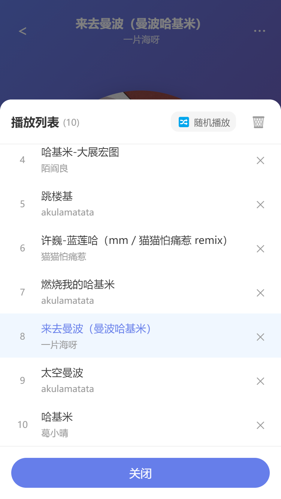

# Uniapp_iMusic

一个基于 Uniapp 开发的在线音乐播放器应用。

## 项目简介

本项目是 基于Uniapp 平台实现的一个的在线音乐播放器，支持音乐搜索、在线播放和歌词同步显示。

## 主要功能

- 🔍 **音乐搜索**: 支持通过歌曲名称或歌手名进行搜索
- 🎵 **在线播放**: 高质量音乐在线播放，无需下载
- 📝 **歌词显示**: 实时同步显示歌词，高亮当前播放行
- ⏯️ **播放控制**: 播放/暂停、上一首/下一首、进度条控制
- 🎨 **美观界面**: 现代化的 UI 设计，流畅的动画效果

## 技术栈

- **框架**: Uniapp + Vue 3
- **状态管理**: Vuex
- **开发工具**: HBuilderX
- **API**: 网易云音乐 API
- **音频**: uni.createInnerAudioContext()

## 快速开始

### 环境要求

- HBuilderX 3.0+
- Node.js (可选)

### 安装运行

1. 克隆项目
```bash
git clone https://github.com/your-username/Uniapp_iMusic.git
cd Uniapp_iMusic
```

2. 使用 HBuilderX 打开项目

3. 点击"运行" -> 选择运行平台
   - 浏览器
   - 微信开发者工具
   - App 等

## 项目结构

```
Uniapp_iMusic/
├── pages/
│   ├── discover/              # 发现音乐页面
│   ├── search/                # 搜索页面
│   ├── mine/                  # 我的音乐页面
│   ├── player/                # 播放器页面
│   └── index/                 # 主页面
├── components/
│   ├── MiniPlayer.vue         # 迷你播放器组件
│   ├── Playlist.vue           # 播放列表组件
│   └── SongList.vue           # 歌曲列表组件
├── store/
│   └── index.js               # Vuex 状态管理
├── static/
│   ├── logo.png               # 应用图标
│   └── tabs/                  # 标签栏图标
├── Music_API_test/            # Python 版本参考代码
├── App.vue                    # 应用配置
├── main.js                    # 入口文件
├── pages.json                 # 页面配置
└── manifest.json              # 应用配置
```

### 基本操作

1. **搜索音乐**: 在顶部搜索框输入歌曲名或歌手名，点击搜索
2. **播放音乐**: 点击搜索结果中的歌曲即可播放
3. **控制播放**: 使用底部的播放控制按钮
4. **查看歌词**: 播放时自动加载并同步显示歌词

## 截图预览

<p align="center">
  
  
  
  
</p>

<p align="center">
  
  
  
  
</p>

## API 说明

本应用使用了以下 API：

- 音乐搜索: `http://music.163.com/api/search/get/web`
- 音乐播放: `http://music.163.com/song/media/outer/url?id={song_id}.mp3`
- 歌词获取: `http://music.163.com/api/song/lyric`

## 注意事项

1. 需要网络连接才能使用
2. 部分歌曲可能需要 VIP 权限
3. H5 端可能存在跨域问题，建议使用 App 或小程序
4. 使用的是第三方 API，稳定性可能受影响

## 未来计划

### 发现页面（discover）
- [ ] 分类推荐 - 实现个性化分类歌曲推荐
- [ ] 排行榜 - 接入实时音乐排行榜数据
- [ ] 私人电台 - 实现个性化电台推荐
- [ ] 歌单详情 - 歌单内容查看和播放
- [ ] 轮播图数据 - 接入实际广告/活动轮播数据
- [ ] 推荐歌单数据 - 接入真实歌单API

### 搜索页面（search）
- [ ] 歌手搜索 - 支持按歌手名搜索
- [ ] 专辑搜索 - 支持按专辑名搜索
- [ ] 歌单搜索 - 支持搜索用户创建的歌单
- [ ] 实时热搜 - 接入实时热搜榜单API

### 我的音乐页面（mine）
- [ ] 用户登录 - 实现用户账号系统
- [ ] 用户设置 - 个人信息、偏好设置
- [ ] 最近播放 - 展示最近播放的歌曲列表
- [ ] 下载管理 - 管理已下载的音乐文件
- [ ] 我的电台 - 创建和管理个人电台
- [ ] 收藏专辑 - 专辑收藏和管理功能

### 播放器页面（player）
- [ ] 分享功能 - 分享歌曲到社交平台
- [ ] 下载功能 - 支持歌曲本地下载
- [ ] 评论功能 - 查看和发表歌曲评论
- [ ] 音乐信息 - 显示歌曲详细信息（专辑、时长等）

### 通用功能
- [ ] 播放列表管理 - 完善播放队列操作
- [ ] 音质选择 - 支持不同音质切换
- [ ] 夜间模式 - 深色主题支持
- [ ] 离线模式 - 离线歌曲播放